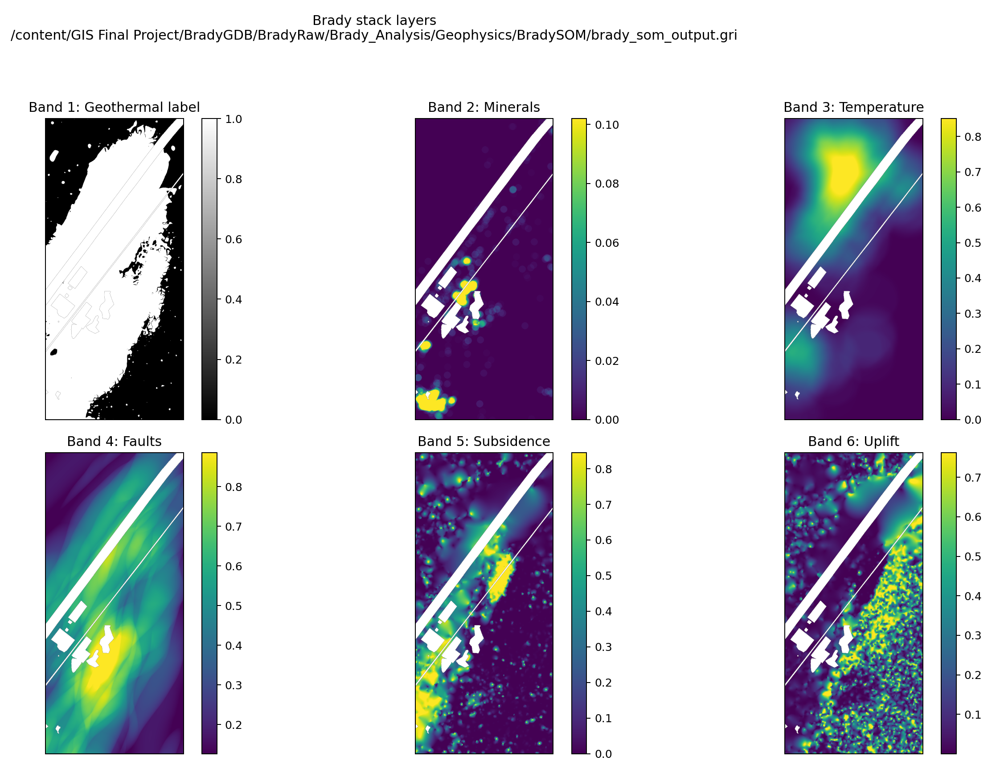
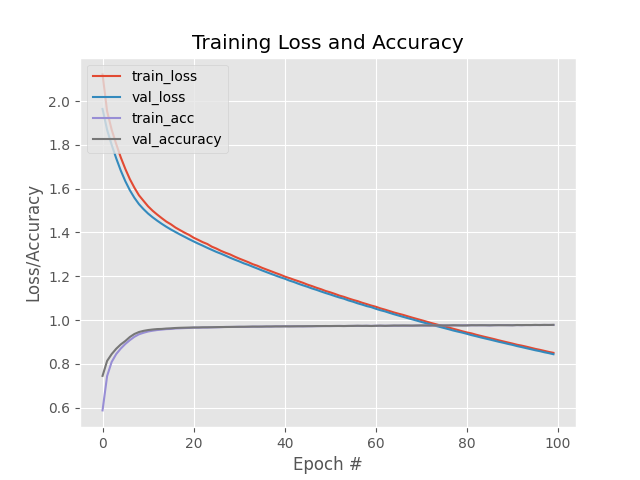
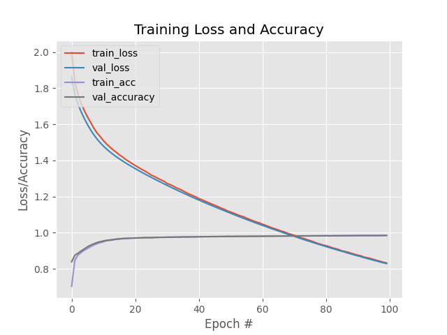
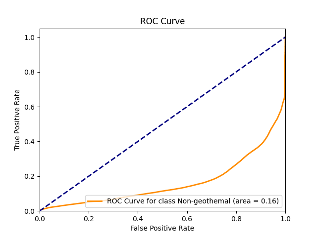
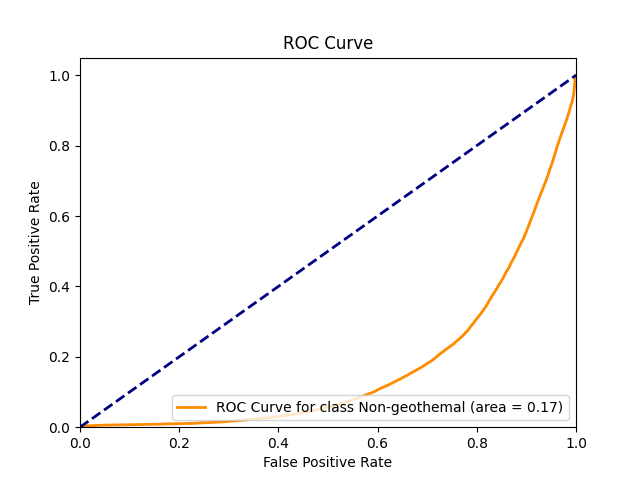
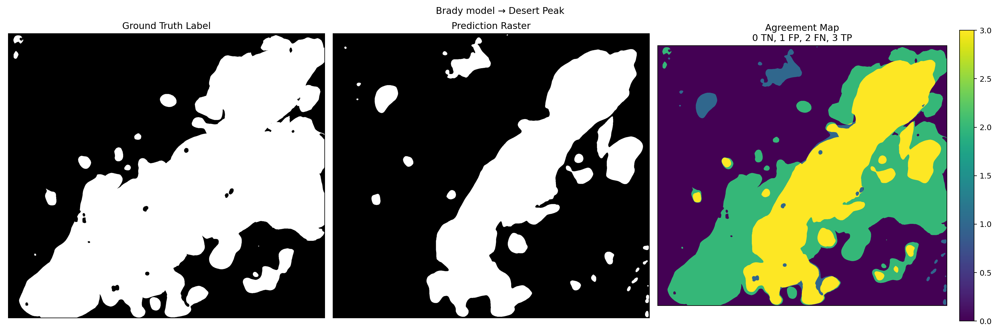
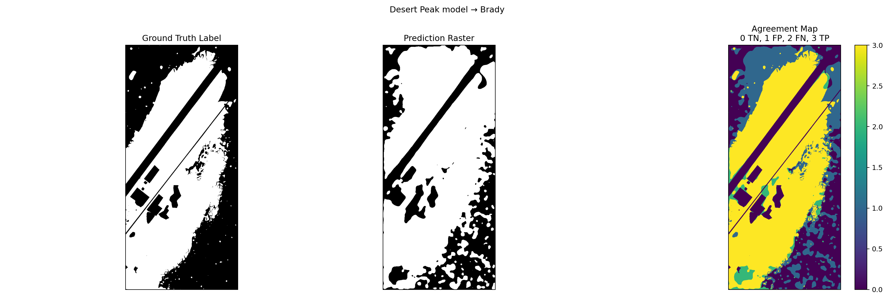

# GeothermalAI

GIS programming final project. I started out trying to replicate the Moraga et al. (2022) Geothermal AI pipeline on DOE data for Brady, Desert Peak, and Salton Sea. The data was in the hundreds of gigabytes, so running everything locally wasn’t really an option.

What I ended up building is a Colab wrapper that keeps the data in Google Cloud Storage, pulls the code from this GitHub repo, runs the original DOE 1307 scripts on a GPU runtime, and saves the outputs. Once that was working, the actual Moraga replication was mostly just configuring runs and checking metrics. The wrapper is the real project.

**Paper:** Moraga, J., Duzgun, H.S., Cavur, M., et al., *The Geothermal Artificial Intelligence for geothermal exploration*, *Renewable Energy* 192 (2022) 134–149. [doi:10.1016/j.renene.2022.04.113](https://doi.org/10.1016/j.renene.2022.04.113)

---

## The Moraga pipeline

The paper treats geothermal prospectivity as a patch classification problem. You stack the input layers, cut 19×19 tiles, train a CNN to tell geothermal from non-geothermal, then map the model back over the full site.

```text
feature stack (.gri)
        │
        ▼
  create_doe_dataset.py   →  19×19 tiles + labels
        │
        ▼
  doe_geoai.py            →  train (.h5) or validate (-v)
        │
        ▼
  doe_ann_map.py          →  full-site prediction map
```

Those scripts are the original DOE / Moraga 1307 code. They live in [`Git_1307/`](Git_1307/). I didn’t rewrite the model — I wrapped how it gets run.

---

## The wrapper

Main notebook: [`colab/colab_1307_git_gcs.ipynb`](colab/colab_1307_git_gcs.ipynb)

Code comes from GitHub. Data stays in GCS. Colab is just the machine that runs the job.

```text
GitHub (code)  ──clone/pull──►  Colab GPU
GCS (data)     ──gsutil──────►  Colab GPU
GCS (outputs)  ◄──sync────────  run folders / metrics
```

What it handles:

1. Auth and config (project, bucket, git branch, run name)
2. Clone / pull this repo
3. Pull the data the run needs from GCS
4. Call `create_doe_dataset.py`, `doe_geoai.py`, or `doe_ann_map.py`
5. Write `run_config.json`, metrics, and plots for that run
6. Sync outputs back to GCS when you’re done

Lightweight copies of the metrics and plots are in [`artifacts/1307/`](artifacts/1307/). Models and the big datasets stay in the bucket. More detail on the cloud setup: [`colab/README.md`](colab/README.md).

---

## Results

These runs used 19×19 kernels, 5 channels, 100 epochs, and 120k held-out tiles. The paper’s tables use a slightly different setup (3 channels, full-site tests), so treat the comparison as close rather than exact. Numbers and JSON: [`cross_site_prediction_metrics.json`](colab/presentation_assets/cross_site_prediction_metrics.json), [`geoai_run_summary.csv`](artifacts/1307/geoai_run_summary.csv).

### Same-site training

| Run | Accuracy | Macro F1 |
|-----|----------|----------|
| Brady `train_brady_19x5d_100ep` | **97.8%** | 97.8% |
| Desert Peak `train_desertpeak_19x5d_100ep` | **98.6%** | 98.6% |

Paper Table 2 for context: Brady 95.5%, Desert Peak 92.3%.

### Cross-site vs paper (Table 3)

| Direction | Paper | This project | Macro F1 |
|-----------|-------|--------------|----------|
| Brady → Desert Peak | **72.4%** | **72.2%** | 70.5% |
| Desert Peak → Brady | **76.3%** | **72.6%** | 71.4% |

Brady → Desert Peak basically matched the paper. Desert Peak → Brady came in lower, with a different precision/recall tradeoff — more detail in [`cross_site_prediction_rasters.md`](colab/presentation_assets/cross_site_prediction_rasters.md).

I also ran some Salton Sea train/eval and transfer runs (`artifacts/1307/metrics_*salton*`). Those were more exploratory; Brady ↔ Desert Peak was the main fidelity check.

### Input stack (Brady)



### Training curves

Brady, 19×5d, 100 epochs:



Desert Peak, 19×5d, 100 epochs:



### Cross-site confusion matrices

Brady model on Desert Peak tiles (72.2%):



Desert Peak model on Brady tiles (72.6%):



### Prediction maps

Brady-trained model on Desert Peak:



Desert Peak–trained model on Brady:



---

## What’s in the repo

| Path | What it is |
|------|------------|
| [`colab/`](colab/) | The wrapper notebook, cloud notes, presentation assets |
| [`Git_1307/`](Git_1307/) | Original DOE / Moraga scripts the wrapper calls |
| [`artifacts/1307/`](artifacts/1307/) | Metrics, run configs, plots from the cloud runs |
| [`scripts/`](scripts/) | Helpers for inventory, export, and GCS upload |
| [`exports/`](exports/) | Inventory snapshots |
